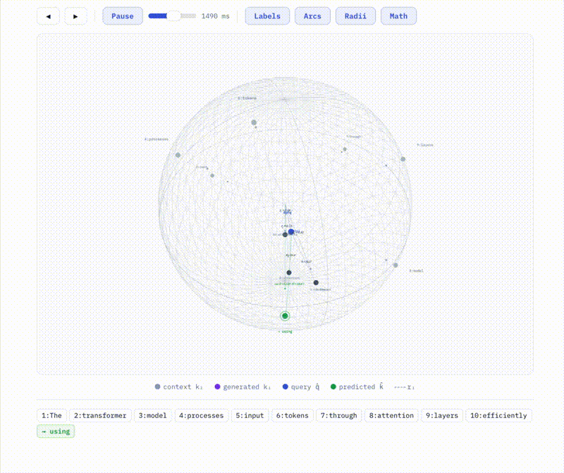
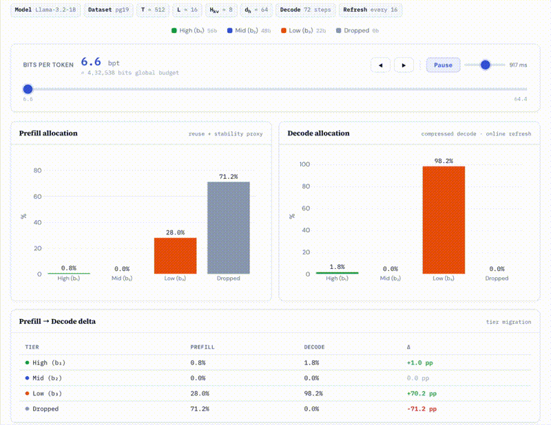

# Spherical KV

<p align="center">
  
  <br>
  <em>Angle-Domain Attention: the decode kernel computes logits directly from spherical codes on the unit sphere, without reconstructing dense key vectors.</em>
</p>

<p align="center">
  <a href="https://www.python.org/downloads/"></a>
  <a href="https://pytorch.org/"></a>
  <a href="https://developer.nvidia.com/cuda-toolkit"></a>
</p>

**Code repository for the paper:** Spherical KV: Angle-Domain Attention and Rate-Distortion Retention for Memory-Bounded LLM Inference.

> *Spherical KV decouples direction from magnitude in the KV cache: Angle-Domain Attention makes direction cheap in the decode hot loop, while Rate-Distortion Retention allocates bits and residency to states likely to matter later.*

---

## Table of Contents

- [Abstract](#abstract)
- [Methodology](#methodology)
- [Results](#results)
- [Installation](#installation)
- [Reproducing Experiments](#reproducing-experiments)
- [Configuration](#configuration)
- [License](#license)

---

## Abstract

Long-context decoding is increasingly limited not by FLOPs but by **KV cache growth**, **High Bandwidth Memory (HBM) bandwidth**, and **peak memory**. As sequence length $T$ scales, KV becomes the dominant resident state, shrinking feasible batch/context and forcing repeated HBM streaming per token that throttles throughput. Current mitigations (windowing/sinks, heuristic eviction, KV quantization/offload) often move the bottleneck rather than remove it: they discard history uniformly, rely on brittle salience proxies, or compress KV yet pay an implicit **reconstruction tax** (unpack/dequantize/rebuild dense vectors) that breaks fusion and restores bandwidth pressure.

We frame KV memory as a **rate-distortion allocation** problem grounded in geometry: attention is primarily **directional** (query-key alignment) with magnitude as a scalar modulator. This yields two principles: **(i)** make direction cheap in the critical path, and **(ii)** allocate bits and residency only to states likely to matter later. We introduce **Spherical KV**, an inference primitive coupling **Angle-Domain Attention** with **Rate-Distortion KV Retention**.

At matched quality (single tolerance $\Delta = 0.8$), Spherical KV consistently shifts the **memory-quality-throughput frontier**: across 8K/32K/128K, we observe **1.55x to 1.72x higher tok/s** while simultaneously reducing **resident KV bytes/token by 24 to 42%**. The gains strengthen in the **128K stress regime**, where paging/fragmentation are most punitive, yet the quality gap remains bounded by design.

---

## Methodology

Spherical KV is built from **two orthogonal ideas** plus a **serving contract**.

### 1. Angle-Domain Attention (no reconstruction)

<!-- <p align="center">
  
  <br>
  <em>Keys are directions on the unit sphere. The decode kernel computes cos θ from angular codes, then scales by radius r. No dense k ∈ ℝᵈ is ever materialized.</em>
</p> -->

Standard attention computes $\ell(\mathbf{q}, \mathbf{k}) = \mathbf{q}^\top \mathbf{k} / \sqrt{d}$. Writing $\mathbf{q} = \|\mathbf{q}\|\hat{\mathbf{q}}$ and $\mathbf{k} = \|\mathbf{k}\|\hat{\mathbf{k}}$ where $\hat{\mathbf{q}}, \hat{\mathbf{k}} \in \mathbb{S}^{d-1}$, the logit decomposes exactly:

$$\ell(\mathbf{q}, \mathbf{k}) = \frac{\|\mathbf{q}\| \, \|\mathbf{k}\|}{\sqrt{d}} \cos\theta, \quad \cos\theta \doteq \hat{\mathbf{q}}^\top \hat{\mathbf{k}}.$$

During **prefill**, keys are encoded into compact spherical tuples: a scalar radius $r_k \approx \|\mathbf{k}\|$, packed angle codes $c_k^\theta$ at tier $b$, plus lightweight tier/flags metadata. During **decode**, the kernel reads packed codes and computes $\widehat{\cos\theta}$ directly via an angular recurrence:

$$\widehat{\cos\theta} \doteq f(c_q^\theta, c_k^\theta;\, b),$$

where $f$ operates on **packed code streams** (SoA layout), is **single pass**, **block local**, and **fusion friendly** for GPU kernels. The critical path difference: instead of reconstructing a dense $\hat{\mathbf{k}} \in \mathbb{R}^d$, the kernel consumes packed K-codes directly and computes similarity via $\cos\theta$ *from codes*, ensuring reductions in KV bytes translate directly to reduced HBM bandwidth.

### 2. Rate-Distortion Retention (keep/drop + precision)

<p align="center">
  
  <br>
  <em>The RDR controller allocates tokens to tiers under a strict bit budget. As the budget tightens, the controller first reduces precision on low impact states before dropping them entirely.</em>
</p>

Under a strict memory budget, selecting a subset of tokens to keep is insufficient: one must also choose the **precision tier** of the retained states. We index cache states by $i$ (token x head; optionally layer) and choose:

$$z_i \in \{0, 1\} \text{ (drop/keep)}, \quad b_i \in \mathcal{B} \text{ (tier)}.$$

The controller solves:

$$\min_{\{z_i, b_i\}} \mathbb{E}[\mathcal{L}(\text{Decode}_{\text{SphKV}}(\{z_i, b_i\}))] \quad \text{s.t.} \quad \sum_i z_i \cdot \text{cost}(b_i) \leq B,$$

which is a rate-distortion allocation problem in the classical sense (Shannon, 1948). The greedy knapsack allocator (Algorithm 1) sweeps tokens by calibrated rate-distortion value, assigning them to tiered quantization levels:

| Tier | Name | Bits | Group size (g) | Centroids (K) |
|------|------|------|----------------|----------------|
| 1 | High | 56 | 16 | 64 |
| 2 | Mid | 48 | 16 | 16 |
| 3 | Low | 22 | 32 | 8 |
| — | Dropped | 0 | — | — |

The output is **paged, tier homogeneous KV pages** compatible with streaming decode kernels: minimal headers, coalesced reads, and block local access patterns.

---

## Results

All results measured under iso-quality constraint $\Delta = 0.8$ on paged/ragged KV serving with A100-80GB GPUs.

### Decode Throughput (tok/s)

| Model | 8K | | 32K | | 128K | |
|-------|------|------|------|------|-------|------|
| | Dense | SphKV | Dense | SphKV | Dense | SphKV |
| Llama-3.1-8B | 173.4 | **268.5** | 110.0 | **183.0** | 62.9 | **108.0** |
| Qwen2.5-14B | 151.6 | **239.4** | 93.3 | **153.9** | 55.7 | **94.8** |
| GPT-oss-20B | 163.7 | **261.2** | 104.9 | **172.5** | 59.9 | **102.4** |

Throughput gains are **stable to improving** with context length (1.55x at 8K, 1.72x at 128K), confirming that HBM bandwidth reduction from angle-domain attention compounds at long context.

### Summary at Δ = 0.8

| Metric | Range (across models and context lengths) |
|--------|-------------------------------------------|
| Quality gap δQ | 0.34 to 0.78 (within Δ = 0.8 tolerance) |
| Throughput gain | 1.55x to 1.72x |
| KV bytes/token reduction | 23.9% to 42.1% |

### Effective KV Bytes/Token Accounting

All reported $b_{\text{KV}}$ values are **all in**: payload bytes, masks/headers, page table entries, indirection pointers, and tier/control metadata. If Spherical KV wins in the throughput tables above, the win survives the most common realism critique.

---

## Installation

```bash
conda create -n sphkv python=3.11 -y
conda activate sphkv
pip install torch==2.5.1 --index-url https://download.pytorch.org/whl/cu121
pip install -r requirements.txt
huggingface-cli login
```

**Hardware:** Codebook training needs 4 GB VRAM (1B models) or 24 GB (8B+). Evaluation at 8K to 32K context requires 24 GB VRAM; 128K+ requires A100-80GB. CUDA kernel compilation needs CUDA 12.1+ with nvcc.

---

## Reproducing Experiments

All experiments are driven by `scripts/experiment_runner.py`. Results are saved to `experiment_results/`.

### Step 0: Train codebooks (one time per model)

```bash
cd src/codebooks && python generate.py
```

Edit `src/codebooks/config.py` to target a different model. Training takes approximately 2 hours on A100 with MiniBatchKMeans.

### Step 1: W1 — Long context language modeling (PG-19)

```bash
python scripts/experiment_runner.py \
  --workloads w1 --context_lengths 8192 32768 131072 \
  --modes dense sphkv sphkv_recon sphkv_angle sphkv_rd \
  --budgets 48 56 64 80 96 112 128 160
```

### Step 2: W2 — Retrieval QA (HotpotQA / 2WikiMultiHopQA)

```bash
python scripts/experiment_runner.py \
  --workloads w2 --modes dense sphkv --budgets 60 \
  --w2_tasks hotpotqa 2wikimqa --w2_distractors 0 3 5
```

### Step 3: W3 — Agentic rollouts (ToolBench)

```bash
python scripts/experiment_runner.py \
  --workloads w3 --modes dense sphkv --budgets 60 \
  --w3_source toolbench --w3_max_episodes 30 --w3_seeds 3
```

### Ablations (Figure 5, A0 to A3)

```bash
python scripts/experiment_runner.py \
  --workloads w1 --context_lengths 8192 32768 \
  --modes dense sphkv keepdrop quant_only decoupled sphkv_angle sphkv_rd \
  --budgets 48 64 80 112 160
```

---

## Configuration

### `configs/config.py` — Pipeline and experiment config

| Parameter | Description |
|-----------|-------------|
| `MODEL_NAME` | HuggingFace model identifier |
| `DEVICE` | `cuda` or `cpu` |
| `TIERS` | List of (tier_id, name, group_size, b_theta, K_centroids) |

### `src/codebooks/config.py` — Codebook training config

| Parameter | Description |
|-----------|-------------|
| `KMEANS_MODE` | `"full"` (best quality, slow) or `"minibatch"` (fast) |
| `NUM_SAMPLES` | Number of C4 texts for training (default: 2000) |
| `SEQ_LEN` | Max sequence length per sample (default: 512) |
| `SAVE_DIR` | Output directory for trained `.pt` files |

---

## License

This code is provided for review purposes only.
